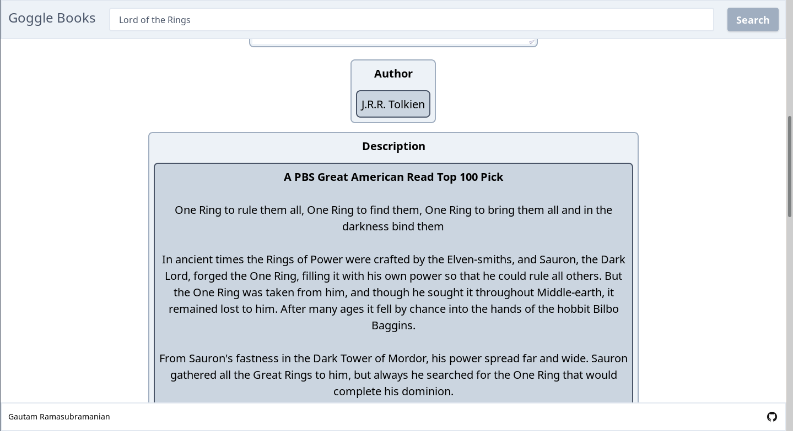

# goggle-books
A web application which is a front-end to Google Books API.

## Purpose
The purpose of this web application is to allow the user to search for books that are available publically.
The user types in a search query, and then the application forwards the query to the Google Books REST API.
The output from there will be redirected back to the user in a pretty format.

## Link

The app is currently deployed on Heroku as of 06-26-19 and is available at the following link.

<https://goggle-books.herokuapp.com>

## Run Locally

If you want to run the project locally, all you need to do is to clone the project, install the dependencies specified
in the package.json file and run the start script.

```
$ git clone https://github.com/gramasu000/goggle-books.git && cd goggle-books/
$ npm install
$ npm start
```

## Project Structure

The directory structure of the project is as follows.


## Timeline

### 07-03-19, 07-04-19, 07-05-19 - Improved Testing for Results page and Details page

### 07-02-19 - Removed Hostname from script file urls

 - Although this is a small action, this allows us to run the same script file for both development and production environments without changes.
 - Now, whether this project is on a laptop, or on a Heroku server, the command `npm start` should get the project running regardless.

### 06-25-19, 06-26-19 - Testing, Logging, Documentation

 - Updated README Timeline, Project Structure
 - Condensed existing tests and created more tests

### 06-24-19 - Deployed new application on Heroku

### 06-23-19 - Created /volume/(id) endpoint

 - Allow users to click on a search result and open a page with details on that book.
 - Created mockups for details page
 - Made Search Result pages - split results into more than one page. 




### 06-22-19 - Created /search endpoint
 
 - App allows the user to type in a search query, press "Search" and get a list of results


### 06-20-19, 06-21-19 - Made more User Interface Tests

 - Stopped using ZombieJS as ZombieJS does not run client-side javascript properly.
 - Searched for alternate options (CasperJS, NightmareJS, etc.) and eventually settled on NightmareJS 
 - Rewrote all tests to use NightmareJS
 - Retained MochaJS Testing Framework

### 06-19-19 - Heroku Deployment Configurations

 - Tried to reroute all HTTP requests to / to HTTPS
 - Needed special expressJS middleware, given by the heroku-ssl-redirect package  

### 06-18-19 - Made User Interface Tests

 - Used ZombieJS headless browser and Mocha testing framework

### 06-16-19, 06-17-19 - Deployed the welcome page on Heroku

Steps:
 - Developed CSS Processing Pipeline - TailwindCSS, PurgeCSS, Autoprefixer, UglifyCSS (Minification)
 - Developed JS Processing Pipeline (Browser Scripts) - UglifyJS (Minification)
 - Used ExpressJS web application server and Pug template engine/renderer

### 06-15-19 - Made the mockups responsive to mobile

   

### 06-13-19, 06-14-19 - Created mockups for desktop using tailwind css


### 06-12-19 - Created hand-drawn mockups for desktop and mobile experience


   

### 06-12-19 - Project Repository Opened
