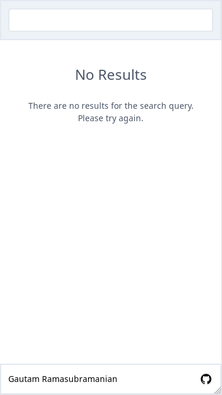

# goggle-books
A web application which is a front-end to Google Books API.

## Purpose
The purpose of this web application is to allow the user to search for books that are available publically.
The user types in a search query, and then the application forwards the query to the Google Books REST API.
The output from there will be redirected back to the user in a pretty format.

## Timeline

### 06-15-19 - Made the mockups responsive to mobile

### 06-13-19, 06-14-19 - Created mockups for desktop using tailwind css

### 06-12-19 - Created hand-drawn mockups for desktop and mobile experience

### 06-12-19 - Project Repository Opened
